<!--
ad-rem-case-study:
  client: Terra Moda
  project: Storefront audit, evidence-backed redesign proposal, and Shopify rebuild for a sustainable fashion boutique
  outcome: A research-grade proposal that earned owner sign-off in a single review, then a custom Direction-3 ("Local Atelier") build on the live Craft theme, with the homepage rebuilt from 2 sections to 6 and every change tied to a published source.
  stack: [Shopify, Liquid, Vanilla JS, Custom CSS, Craft theme base]
  liveUrl: https://theterramoda.com
  year: 2026
  thumbnail: screenshots/after/home.png
  timeline: Audit and proposal in 5 days, rebuild rolling in 3 phases
  engagement: Fixed-price, phased
  order: 2
-->

# Terra Moda · From "Cover Photo and a Wall of Text" to a Local Atelier

Took a family-owned Frederick, Maryland boutique's Shopify store from a homepage with two sections (a single cover photo and a 400-word text block) to a research-backed redesign the owner approved in one review, then built it on their live Craft theme. Every recommendation in the proposal is cited. Every section in the rebuild has a reason. No paid Shopify apps added.

> **Live site:** [theterramoda.com](https://theterramoda.com)
> **Proposal (HTML):** [`docs/terra-moda-redesign-proposal.html`](./docs/terra-moda-redesign-proposal.html)

---

## The problem

Terra Moda is a small, family-run boutique in downtown Frederick. They carry men's, women's, children's, and dog products from artisan vendors with real sustainability and fair-labor credentials (Fair Trade, B-Corp, GOTS). The product is great. The brand story is real. The store at 218 N Market St is a destination.

The website was not pulling its weight.

When the owner came to us, the storefront ran on stock Shopify Craft, lightly configured. A look at every theme file and the live site surfaced four problems, and each one had a measurable cost:

- **The home page showed no products.** Two sections total: a wide cover photo of the store interior, and a 400-word "Who We Are" paragraph. A first-time visitor could not see a single thing for sale without clicking into the nav.
- **No social proof anywhere.** No reviews, ratings, or testimonials, despite the brand having Fair Trade, B-Corp, and GOTS certifications worth showcasing.
- **The brand story was buried.** The "Who We Are" copy is genuinely good. It sat below the fold, in a dense paragraph, where almost no one reads it. The strongest differentiator was the least-seen asset.
- **Polish gaps that read as "unfinished."** Empty footer brand fields, zero spacing between sections, reveal animations turned off, and a dead 175 KB `sparkle.gif` loading on every single page.

This was not a broken codebase. The Craft theme was clean. The problem was configuration, merchandising, and content strategy. So the engagement started with a written, evidence-grade case for change, not with code.

## What we built

### A research-grade redesign proposal, not a mood board

The first deliverable was a self-contained HTML proposal document the owner could open in any browser, send to a partner, and read end to end without a meeting. It is in this repo at [`docs/terra-moda-redesign-proposal.html`](./docs/terra-moda-redesign-proposal.html).

The structure is deliberate:

1. **An honest audit** of the existing site, each finding paired with a one-line cost statement so it reads as a business problem, not a design opinion.
2. **The evidence.** Six stat cards, each citing a research-grade source: Nielsen Norman Group on above-the-fold attention, Spiegel/Medill Research Center on reviews lifting purchase likelihood (+270% with even five reviews, rising to +380% on higher-priced items), peer-reviewed work on third-party certification and consumer trust, Baymard Institute on home-page breadth and mobile abandonment, Forrester/Criteo on research-online-purchase-offline behavior. Vendor data was marked separately and treated as directional only.
3. **Competitive context.** A reading of nine independent and sustainable fashion stores (Taylor Stitch, Kotn, Buck Mason, Asket, Corridor NYC and others) that balance storytelling, conversion, and a physical store. The pattern the strongest ones share: the brand story sits *between* shopping paths, never as a wall in front of them.
4. **Three proposed directions**, fully mocked in the document itself using only the client's existing vendor photography. Each direction is annotated A/B/C/D/E with the research that justifies that specific choice.
5. **A clear recommendation** with the trade-offs of the other two written down, not buried.
6. **A three-phase rollout** so the highest-impact, lowest-risk work lands first.

The three directions optimize for different goals:

- **Direction 1 · The Editorial Boutique.** Brand-led. For when the priority is making the site *feel* as premium as the clothing.
- **Direction 2 · The Curated Shop.** Conversion-led. Catalog-forward, products within one scroll, testimonials before the fold.
- **Direction 3 · The Local Atelier (recommended).** Balanced. Story sandwiched between shopping paths; the Frederick store elevated to a first-class section with an events hook.

The owner approved Direction 3 on the first read. No further rounds.

### The Direction 3 rebuild, on the live Craft theme

The implementation runs against the existing Craft theme, not a new theme from scratch. That choice was intentional. Replacing the theme would have meant losing every product metafield, redirect, app integration, and customer-side detail Shopify has accreted around the store. The proposal already established that the code was not the problem; configuration and section composition were. So we rebuilt the homepage and surrounding pages on Craft itself.

What that meant concretely:

**The homepage was rebuilt from 2 sections to 6**, fully described in `templates/index.json`:

1. `hero`: image banner with the editorial copy and dual CTAs ("Shop the Collection" + "Our Story"), text-box dropped, copy left-anchored over a gradient veil, cream primary button per Direction 3.
2. `categories`: four-tile collection list (Men's, La Segreta, Outerwear, Accessories), portrait ratio, two-up on mobile.
3. `new_arrivals`: featured-collection grid of 8 products from `all`, four columns desktop, two columns mobile with swipe.
4. `why`: three-column value strip (Fair Labor / Sustainable / Artisanal) with a single "Read Our Full Story" door, per the NN/g finding that 79% of users scan rather than read.
5. `lasegreta`: custom-liquid two-panel band giving the women's collection its own consistent visual treatment, with a "Shop La Segreta" CTA.
6. `visit`: custom-liquid two-panel band with an embedded Google Maps iframe on the left and visit info plus a "Get Directions" CTA on the right, the Frederick store treated as a first-class section instead of a footer afterthought.

**Quick wins that moved alongside the homepage:**

- Section spacing turned on (`spacing_sections: 36`) and reveal-on-scroll animations enabled.
- Empty footer brand fields filled in.
- The dead 175 KB `sparkle.gif` deleted from `assets/`.
- A utility bar added with the trust signal and the local hook ("Free shipping & easy returns · Visit us in Historic Downtown Frederick").
- Footer brand pillar trust strip, "Get Directions" CTA, brand close line, bigger centered logo.

**Custom theme code shipped alongside Craft:**

- `tm-nav.css` for a theme-driven self-sufficient mega menu (category images and "More" link), locale-safe URLs, no admin dependency on every change.
- A compact button-anchored dropdown (320px) that opens on hover, with overrides to fix Craft's base `.mega-menu__list display:grid` that was squeezing menu items into six columns.
- Product card hover treatment with portrait ratio and a fixed cover-image box.
- Product detail page reorder (Title → Vendor → Description), variant picker hidden when there is one variant, "Pay in installments" removed, price moved inline with Add to Cart, description moved below it, pickup status kept while hiding "Usually ready in 24 hrs" and "View store info".
- Branded contact page with a styled form and a visit info block, the duplicate Formful app block removed.
- Announcement bar links wired to Google Maps directions.

**What we deliberately did *not* do:**

- No new paid Shopify apps. The "verified customer reviews with star ratings" pattern that the proposal cites as a +270% to +380% purchase-likelihood lift normally needs a paid app, since Shopify's built-in reviews is retired. The plan is to build this as custom code in Phase 2 so it stays free for the client.
- No theme replacement. The existing Craft theme stays in place.
- No images forced. The hero and La Segreta image slots intentionally fall back to Craft's native placeholder so the owner can pick the editorial imagery later in the theme editor without blocking the rebuild.

### Product copy rewritten across the entire catalog

Every product page is getting a full rewrite, not just the names. Every paragraph. The previous copy read like default Shopify variant fields — color, size, material, repeat — for products whose *whole point* is the maker behind them. The new copy talks like the brand actually talks. Each piece is tied to its vendor and the materials' provenance, references the certifications behind it (Fair Trade, B-Corp, GOTS where applicable), and matches the editorial voice of the Direction 3 rebuild. Product pages stopped feeling like a catalog of items the store happens to carry and started feeling like the brand's argument for *why* this specific piece, from this specific maker, sits on the rack at 218 N Market St. That's the difference between a visitor landing on a PDP and bouncing vs. landing on a PDP and adding to cart — and on a brand whose entire pitch is the story behind the product, leaving the default Shopify copy in place was leaving the strongest asset on the table.

## The three-phase rollout

The work is sequenced so the highest-impact, lowest-risk changes land first:

1. **Phase 1 · Home page rebuild + quick wins.** The Direction 3 homepage, the spacing/animations/asset-cleanup fixes, the footer brand fields, the utility bar. (Shipped to the development theme.)
2. **Phase 2 · Trust and merchandising.** Visit-Us section with embedded map and events hook, gratitude-framed email capture with a first-order incentive, certification credibility, collection-page polish, product copy rewritten across the entire catalog, cleanup of redundant and half-finished templates, custom reviews and ratings built in code so the client does not take on a monthly app subscription. (Largely in progress; nav redesign and product-card hover are part of this phase.)
3. **Phase 3 · Conversion polish.** Product-page improvements (large imagery, scannable variants, sticky add-to-cart on mobile), cross-sell, mobile pass, local SEO and Google Business Profile alignment to capture the research-online-buy-in-store behavior the Forrester/Criteo data flags as ~92% of in-store purchases.

## Outcome

- **A research-backed proposal that landed on the first review.** No round-two design churn, no "we'll think about it for a few weeks." Direction 3 approved, rollout sequenced, build started.
- **Homepage went from 2 sections to 6.** Live home full-page screenshot grew from 2,538 px tall (before) to 4,729 px (after), with every new section justified by a specific cited finding from the proposal.
- **Zero added monthly cost.** Every pattern the proposal recommends, including the one normally bought as an app (verified reviews), is being built as custom code in the theme.
- **A clear, defensible story to send to a partner.** The owner can hand the proposal HTML to anyone (a co-founder, an investor, a friend with retail experience) and they can read why each change is happening without a meeting.
- **The brand story moved from below-the-fold paragraph to a scannable three-value strip plus a dedicated "Read Our Full Story" door,** per the Nielsen Norman Group finding that 79% of users scan rather than read.

## Screenshots

The home page tells the whole story. Full-page captures, original on the left, Direction 3 rebuild on the right.

### Home page

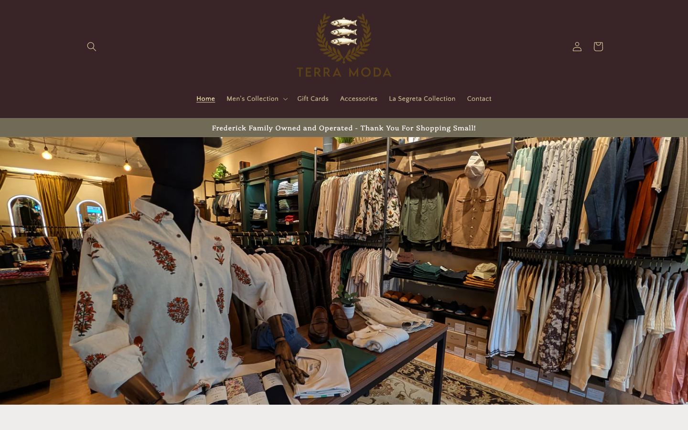
*Before. The live home page. A single cover photo and a thank-you line. No products. No story preview. No path into the catalog without using the nav.*

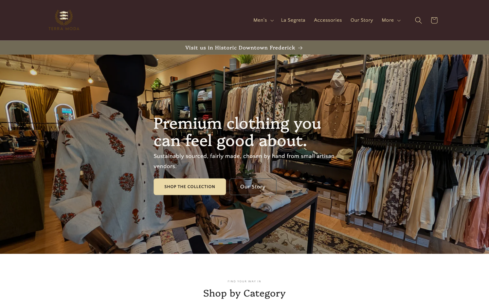
*After. Direction 3, "The Local Atelier." Editorial hero with the brand promise and dual CTAs. The full sequence is hero → categories → products → value strip → La Segreta band → visit, scannable end to end.*

### Men's collection

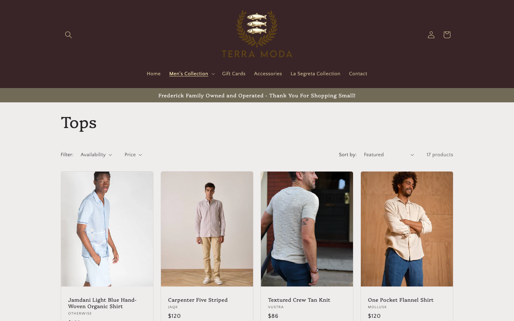
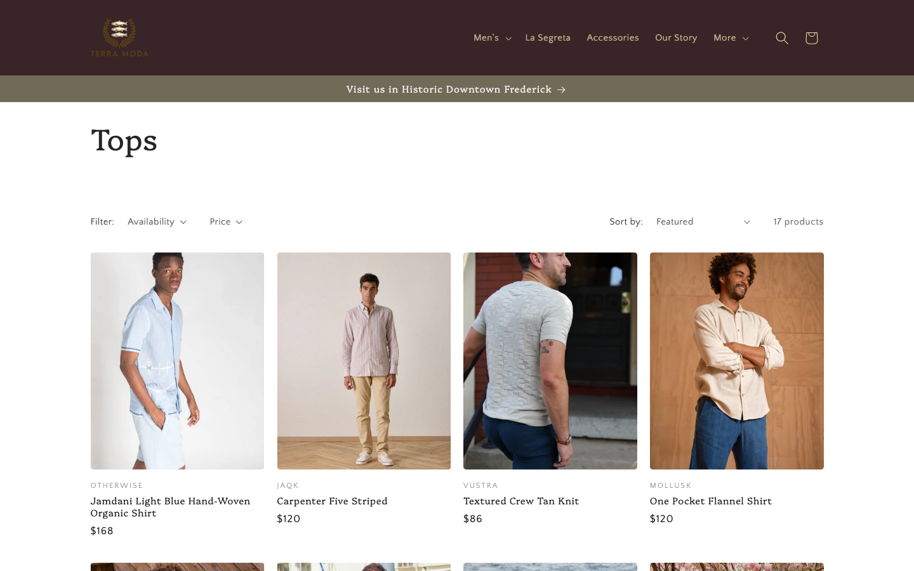

### La Segreta (women's)

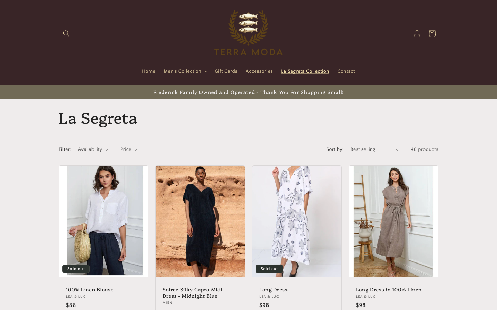
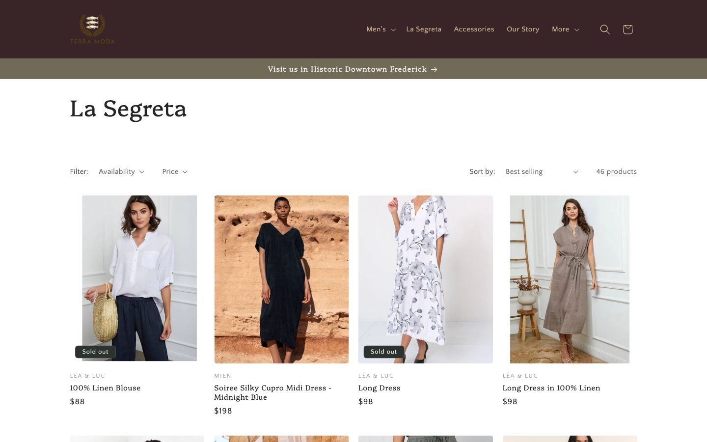

### Product detail page

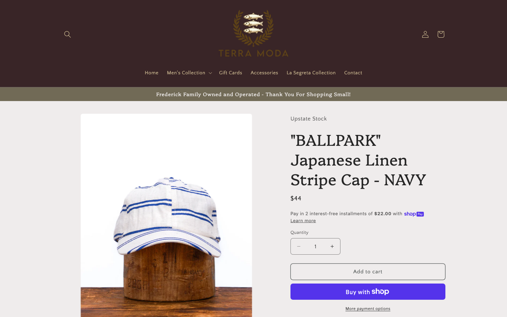
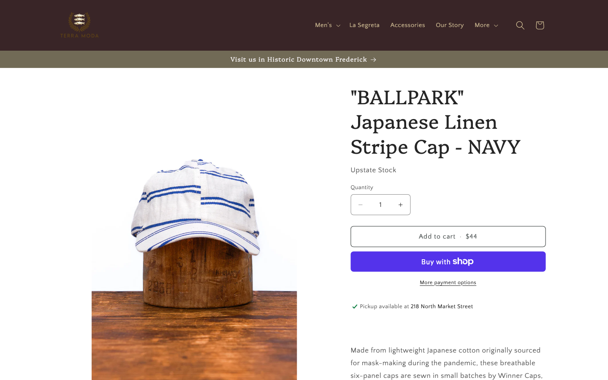

### Our Story

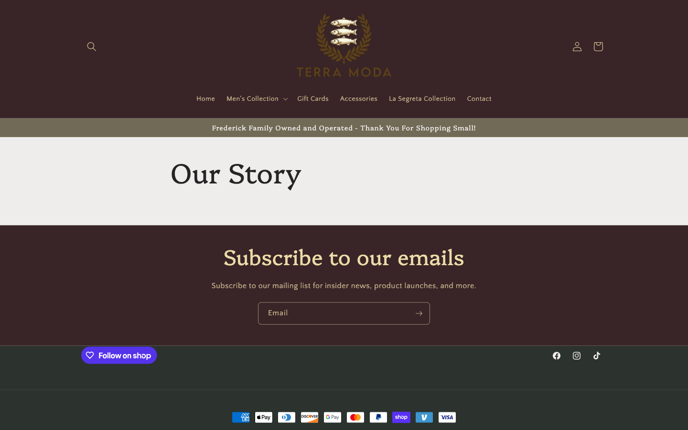
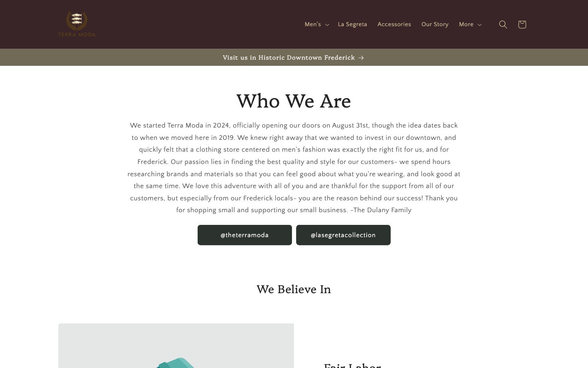

### Contact / Visit

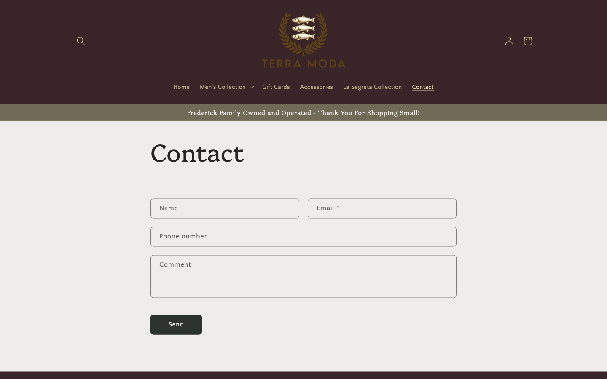
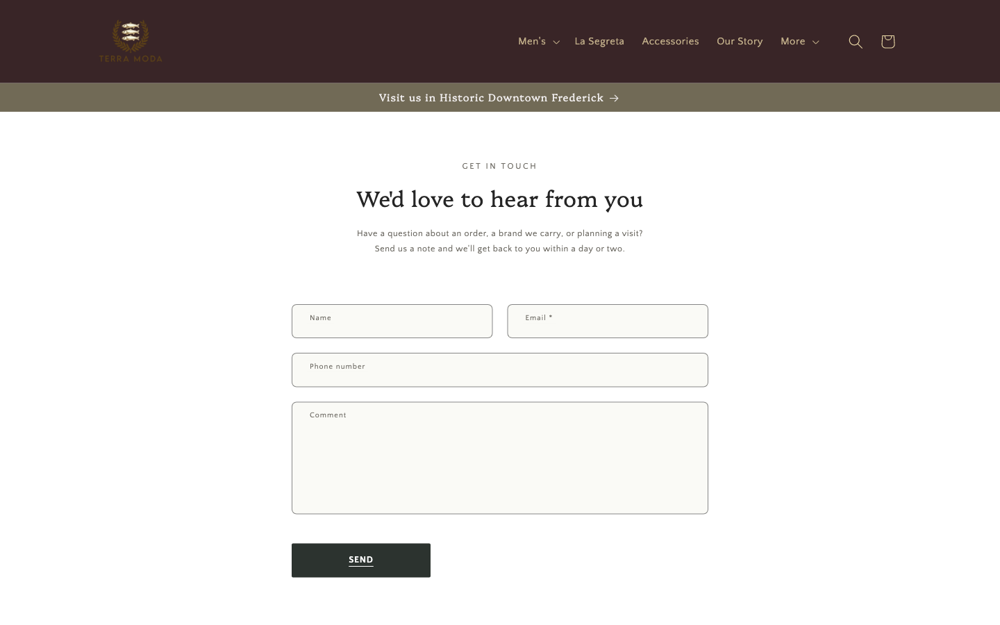

## Stack

| Layer | Technology |
|---|---|
| E-commerce platform | Shopify |
| Theme base | Craft v15.3.0 (customized in place, no replacement) |
| Templating | Liquid |
| Client code | Vanilla JavaScript |
| Styling | Custom CSS (`tm-nav.css` and friends) |
| Type | Quattrocento (display), Quattrocento Sans (body) |
| Brand colors | Forest `#2c332f`, burgundy `#392527`, cream `#ecdaa8`, paper `#f7f5f1` |
| Maps | Google Maps embed (`/maps?q=...&output=embed`) |
| Proposal hosting | Vercel (HTML document version of `docs/terra-moda-redesign-proposal.html`) |

## Timeline & engagement shape

- **Audit + proposal:** 5 days, single approval round.
- **Rebuild:** rolling, phased.
- **Phase 1 (homepage + quick wins):** shipped to development theme.
- **Phase 2 (trust + merchandising + nav + custom reviews + product copy rewrite):** in progress.
- **Phase 3 (PDP polish + mobile + local SEO):** scheduled.
- **Engagement type:** fixed-price.
- **Status:** in progress against the live Craft theme, gated by owner approval at each phase. Push to draft/published only on the owner's go-ahead.

---

*Built by [Ad Rem](https://adrem.services). For engagement inquiries: [hello@adrem.services](mailto:hello@adrem.services) or [book a call](https://cal.com/ad-rem/30min).*
